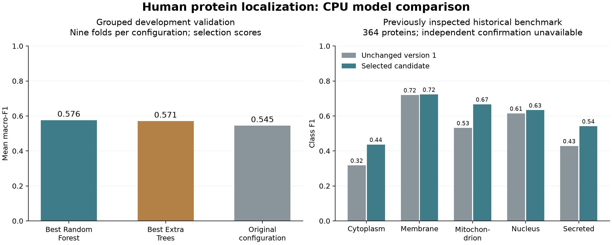

# Expanded-data CPU model comparison

This workflow implements preparation, grouped Random Forest/Extra Trees selection, evaluation and conditional promotion. **Version 1 remains the UI default:** the fresh retrieval does not provide independent confirmation proteins for all five classes. The candidate and its development/previously inspected benchmark results are research outputs, not evidence for a new validated default.

The existing 423 features, single-label human scope, five compartments and tree SHAP are unchanged. Probabilities remain uncalibrated. There is no SMOTE, GPU, embedding model or refitting on evaluation proteins.

The later [scientific revision](research-revision.md) adds nested development validation, simple learned baselines, terminal-feature ablations, calibration, and annotation/study-dependence sensitivity. It also corrects the cohort scope:one mapped structured annotation does not establish exclusive biological localization; original free-text notes can describe other compartments. Both downloaded snapshots have the same source hash, so the expansion came from removing class caps, not new release evidence.

## Measured results and candidate model card

Experiment `human-v2-fcd650fe52bf` completed all 441 fits in **18.95 minutes** on an **Apple M2 Max, 12 logical CPUs, 32 GiB RAM**, using four concurrent fit workers. The sum of per-fold fit/score/serialization times was 4,344.10 seconds; wall time includes feature extraction, final fitting and artifact validation. The candidate uses 512 Random Forest trees, unlimited depth, leaf size 1, 0.5 feature sampling, balanced class weights and seed 42. Its model ID is `human-v2-fcd650fe52bf-random_forest` and its size is **25,942,589 bytes (24.74 MiB)**. It is trained on 1,741 development proteins and has no independent confirmation.

| Configuration                    | Mean development macro-F1 | Fold SD | Mean log loss | Mean fold artifact MiB |
|----------------------------------|--------------------------:|--------:|--------------:|-----------------------:|
| Best Random Forest               |                    0.5761 |  0.0228 |        1.0600 |                  16.89 |
| Best Extra Trees                 |                    0.5706 |  0.0183 |        1.0942 |                  14.92 |
| Original configuration, refitted |                    0.5446 |  0.0285 |        1.1654 |                   3.67 |

Extra Trees did not win this search. Its best configuration used 512 trees, depth 12, leaf size 5, 0.5 feature sampling and balanced weights. Family differences are small relative to fold variation; this experiment does not establish universal Random Forest superiority.



On the **previously inspected 364-protein benchmark**, the frozen winner achieved:

| Metric                                   | Candidate | Unchanged version 1 | Prior dummy |
|------------------------------------------|----------:|--------------------:|------------:|
| Macro-F1                                 |    0.6002 |              0.5223 |      0.0862 |
| Weighted F1                              |    0.6072 |              0.5465 |      0.1184 |
| Balanced accuracy                        |    0.6049 |              0.5292 |      0.2000 |
| Log loss (lower is better)               |    1.0499 |              1.1867 |      1.5709 |
| Multiclass Brier (lower is better)       |    0.5348 |              0.5966 |      0.7912 |
| Top-label ECE, 10 bins (lower is better) |    0.1287 |              0.1617 |      0.1141 |

| Compartment   | Candidate precision | Recall |    F1 | Version 1 F1 | Support |
|---------------|--------------------:|-------:|------:|-------------:|--------:|
| Cytoplasm     |               0.492 |  0.392 | 0.437 |        0.317 |      79 |
| Membrane      |               0.681 |  0.770 | 0.723 |        0.720 |     100 |
| Mitochondrion |               0.667 |  0.667 | 0.667 |        0.532 |      39 |
| Nucleus       |               0.636 |  0.630 | 0.633 |        0.615 |     100 |
| Secreted      |               0.520 |  0.565 | 0.542 |        0.429 |      46 |

All class F1 values increased on this historical benchmark, but Cytoplasm remains weak (F1 0.437). The paired group-bootstrap 95% interval for candidate macro-F1 is**0.527–0.650**, and for the difference versus version 1 is **+0.032 to +0.124**. No bootstrap replicate lacked a class. The point difference is +0.0779; historical benchmark familiarity and development model selection still limit interpretation. The dummy classifier has lower ECE despite poor discrimination, illustrating why ECE alone is not a model-selection or calibration guarantee.

Candidate confusion matrix, rows annotated / columns predicted:

| Annotated \ Predicted | Cytoplasm | Membrane | Mitochondrion | Nucleus | Secreted |
|-----------------------|----------:|---------:|--------------:|--------:|---------:|
| Cytoplasm             |        31 |       15 |             7 |      19 |        7 |
| Membrane              |         5 |       77 |             0 |       8 |       10 |
| Mitochondrion         |         3 |        3 |            26 |       4 |        3 |
| Nucleus               |        21 |        8 |             4 |      63 |        4 |
| Secreted              |         3 |       10 |             2 |       5 |       26 |

| Operation                        | Candidate median ms | Version 1 median ms | Ratio |
|----------------------------------|--------------------:|--------------------:|------:|
| Predict one, features ready      |               18.87 |                6.08 | 3.10× |
| Predict 100, features ready      |               24.61 |                7.75 | 3.17× |
| SHAP one                         |               42.57 |                9.11 | 4.67× |
| Feature extraction + predict one |               21.40 |                8.11 | 2.64× |
| Feature extraction + predict 100 |               52.37 |               34.92 | 1.50× |

Single-sequence feature extraction took 2.28 ms. These measurements were made on the same local hardware after training completed, with five warm repetitions and one estimator worker per model; they are not service throughput guarantees.

**Promotion decision: rejected; version 1 retained.** Independent confirmation is unavailable, and single/batch prediction plus SHAP exceed the 2× latency gate. Although the historical F1 and log-loss comparisons pass their numerical gates, they cannot substitute for independent confirmation. No evaluation proteins were used to refit either published artifact.

The frozen candidate, curation, scores, predictions, exact software environment, completion hashes and promotion decision are preserved in [`examples/experiments/human-v2`](https://github.com/zeyuyaoy/mapexploc/tree/main/examples/experiments/human-v2). Its 441 individual fold records are archived in `folds.tar.gz`; `checksums.json` covers the bundle. The original downloaded JSON remains in the local ignored `artifacts/human-v2/source.json`; its SHA-256 is recorded in the bundle. The candidate artifact retains its frozen `development_only` training metadata; the separate `evaluation.json` labels the later benchmark `historical_diagnostic`. Neither is presented as independent confirmation. The original artifact and reports remain unchanged under `examples/models` and `examples/baseline`.

To inspect the candidate explicitly without changing the default manifest:

```bash
MAPEXPLOC_MODEL_PATH=examples/experiments/human-v2/candidate.joblib \
  python -m uvicorn mapexploc.api:app --host 127.0.0.1 --port 8000
python examples/experiments/human-v2/render-results.py --output artifacts/model-comparison.png
```

## Data and partitions

UniProtKB/Swiss-Prot was retrieved again on **2026-09-18** and still reported release **2026_03**. Strict curation retains canonical reviewed human sequences with experimental localization evidence and one supported compartment. Structured location evidence is retained before normalization; ambiguous, conflicting, isoform/product-specific and unsupported-residue records are excluded. Membrane means cell/plasma membrane. See [UniProt's annotation guidance](https://www.uniprot.org/help/subcellular_location).

A cap of 1,000 per class yields 2,107 proteins (none reaches the cap), versus 1,822 in version 1. Raising the cap adds 7 Membrane and 278 Nucleus proteins. There are no changed sequences or changed labels among the original accessions in this run.

| Compartment   | Curated | Development | Excluded historical groups | Eligible independent new | Shortfall below 20 eligible |
|---------------|--------:|------------:|---------------------------:|-------------------------:|----------------------------:|
| Cytoplasm     |     395 |         316 |                         79 |                        0 |                          20 |
| Membrane      |     507 |         406 |                        101 |                        3 |                          17 |
| Mitochondrion |     193 |         154 |                         39 |                        0 |                          20 |
| Nucleus       |     778 |         677 |                        101 |                      249 |                           0 |
| Secreted      |     234 |         188 |                         46 |                        0 |                          20 |
| Total         |   2,107 |       1,741 |                        366 |                      252 |                          77 |

The eligibility shortfall is a lower bound: reserving approximately 20% also requires enough independent groups. No five-class confirmation set can be frozen, so all eligible new proteins remain in development. This is reported explicitly; previously inspected proteins are never relabeled as independent confirmation.

MMseqs2 **18-8cc5c** searches the union of original and refreshed sequences at 30% identity and 80% bidirectional coverage. Internal IDs combine accession and sequence hash, preserving both sequence versions if an accession changes. Connected components, including links through unsampled records, define groups. Historical test accessions and every connected group are excluded from fitting. The 366 excluded refreshed records include the original 364 test accessions plus two new related records. Both development-to-historical and reverse searches found zero qualifying cross-partition hits. These thresholds do not rule out all remote or domain-level homology; see the [MMseqs2 methods documentation](https://github.com/soedinglab/MMseqs2/wiki).

## Reproduce the workflow

Use Python 3.14.6 and the recorded scientific environment for exact run resumption. Python 3.12 and 3.14 are tested for supported package use. Install the package and MMseqs2, then run from the source repository:

```bash
python -m pip install -e '.[dev,docs,plots]'
# Explicit download; choose a new directory for a new snapshot.
mapexploc baseline-download --directory artifacts/human-v2
mapexploc experiment-prepare --directory artifacts/human-v2 --reference-root . --cap 1000 --threads 4
mapexploc experiment-train --directory artifacts/human-v2 --jobs 4
mapexploc experiment-evaluate --directory artifacts/human-v2
mapexploc model-promote --directory artifacts/human-v2 --repository .
```

The download command deliberately remains separate and never runs in ordinary CI. A future live response may differ from this snapshot: compare source hashes before claiming reproduction. The preserved reference bundle records source URL, release, retrieval time, hashes, structured evidence, exclusions and partition membership. UniProt data are attributed to the UniProt Consortium under [CC BY 4.0](https://www.uniprot.org/help/license).

`run.json` freezes configuration, source/header/reference hashes, software versions and implementation hash. `design.json` freezes candidate parameters and all fold memberships before fitting. Per-fold JSON checkpoints permit interrupted training to resume. Stage completion markers hash the outputs; changed inputs, completed outputs, software or code are rejected. Resume in the same reference checkout and environment, or start a new run directory. Repeating completed evaluation returns the recorded result instead of reevaluating the frozen candidate.

The existing `baseline-download`, `baseline-prepare` and `baseline-train` behavior is preserved. See [version 1 reproduction](baseline.md) for that separate protocol.

## Candidate search and selection

Random Forest averages trees trained with bootstrap sampling. Extra Trees adds random split thresholds and here uses the full development fold without bootstrap sampling. Both receive identical features and fitted preprocessing. See the [scikit-learn ensemble reference](https://sklearn.org/stable/modules/ensemble.html#extremely-randomized-trees).

Seed 42 samples 24 configurations independently from each family:

| Parameter                   | Values                             |
|-----------------------------|------------------------------------|
| Trees                       | 256, 512                           |
| Maximum depth               | 12, 24, unlimited                  |
| Minimum leaf size           | 1, 3, 5                            |
| Feature sampling            | square root, 0.5                   |
| Random Forest class weights | none, balanced, balanced-subsample |
| Extra Trees class weights   | none, balanced                     |

Each configuration uses three stratified grouped folds for seeds 42, 43 and 44:432 fits. The original configuration (128 trees, depth 24, leaf size 3, square-root features, balanced weights) is refitted on the same nine folds as a reference, for **441 candidate/reference fits**. At most four fits run concurrently, with one worker per estimator. Every fold must contain all five classes and disjoint groups.

Rank by nine-fold mean macro-F1, lower mean log loss, smaller mean serialized fold model size, then stable parameter JSON. The original configuration is a comparator, not a selectable candidate. Fit the winner once on all development proteins using seed 42. Development selection scores are optimistic estimates after model search; the nine folds overlap and their standard deviation is not an independent-sample confidence interval.

## Evaluation and promotion

The frozen candidate is evaluated once on independent confirmation if feasible; otherwise the unchanged 364-protein historical benchmark is labeled `historical_diagnostic`. The baseline artifact and prior dummy classifier are compared on the same records. Reports include macro/weighted F1, balanced accuracy, per-class precision/recall/F1/support, confusion matrices, log loss, multiclass Brier score and ten-bin top-label ECE.

Paired whole-group bootstrap intervals use 2,000 draws with seed 42, retaining a fixed five-class macro average. Replicates missing classes are counted and retained with zero F1 for absent classes. These intervals describe this benchmark; they do not make historical data independent or measure all model-selection uncertainty.

Warm timing uses five-repetition medians, alternating model order and identical inputs, with one estimator worker for both models. Reports distinguish prediction from feature extraction, batch size 100, end-to-end latency and single-protein SHAP. Both artifacts must reload with the 423-feature schema, consistent class order and SHAP additivity. Version 1 is never refitted on the historical benchmark.

Promotion requires independent confirmation plus every predeclared gate:

- Macro-F1 gain at least 0.03 versus the unchanged baseline on the same proteins.
- For new promotion decisions after the scientific revision: the paired 95% macro-F1 difference interval must also have a strictly positive lower bound.
- No class F1 decline greater than 0.05; no increase in log loss.
- Single/batch prediction and SHAP median latency each at most twice the baseline.
- Artifact reload, schema, class order and SHAP additivity checks passing.

Insufficient evidence or failed gates retain version 1 and publish rejection reasons. A passing candidate is published separately; the default manifest is updated atomically and its previous version and artifact remain available for rollback. Passing point-estimate gates does not establish statistical significance.

## Default model resolution

`config/default-model.json` pins schema version, trusted repository-relative artifact path, model ID and SHA-256. It initially designates the unchanged version 1 artifact. Explicit `create_app(model=...)` / `create_app(model_path=...)` arguments have highest precedence. Module startup then checks `MAPEXPLOC_MODEL_PATH` before the repository manifest. Relative explicit overrides use the working directory; manifest paths use the package's source repository independently of that directory.

Traversal, escaping symlinks, invalid manifests, checksums and model identities are rejected. An invalid override never silently falls back. Wheels contain offline examples but no research model; they return actionable configuration guidance and unavailable readiness until an operator configures a trusted artifact. Explicit legacy model loading still works. `/model` and the UI's Model & methods disclosure show allowlisted identity, family, evaluation status and provenance.

## Validation of this implementation

The completed checks cover both the original and new workflows:

| Surface                   | Result                                                                                                                               |
|---------------------------|--------------------------------------------------------------------------------------------------------------------------------------|
| Python 3.12.13 / 3.14.6   | 50 tests pass on each, including both frozen artifacts' predictions and SHAP additivity                                              |
| Python quality            | Ruff, Black, mypy and dependency consistency checks pass                                                                             |
| Installed wheel           | CLI train → predict → explain, packaged offline examples, unavailable default and explicit API override pass on both Python versions |
| Frontend                  | Frozen pnpm 11.18.0 install, examples synchronization, formatting, lint, 11 unit tests and Vite production build pass                |
| Browser                   | Three workflows pass: batch/tabs/downloads, upload/mobile/keyboard, cancellation/explanation failure/retry                           |
| Documentation / packaging | Strict MkDocs builds on both Python versions; wheel and source distribution build                                                    |
| Experiment integrity      | All 441 fold records verified; completed-stage reruns preserve model and evaluation hashes                                           |

Ordinary tests remain offline and use small synthetic fixtures for experimental control flow. Source reference regression tests read the frozen artifacts locally. Upstream deprecation warnings and scikit-learn's version 1.9.0-to-1.9.1 pickle warning remain visible; predictions and SHAP consistency were checked explicitly. The original version 1 data, artifact and evaluation reports are unchanged.
