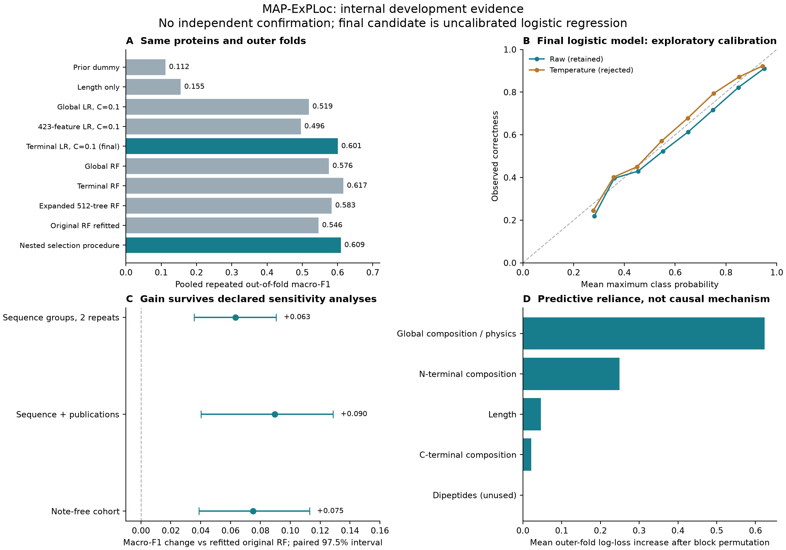

# Scientific revision: completed development study

**This is an improved internal research pipeline, not an independently validated localization service.** Nested grouped selection improved macro-F1 from **0.5462 to 0.6094**, with paired whole-group 97.5% difference interval **+0.0357 to +0.0907**. Full-development selection chose a smaller **63-feature L2 multinomial logistic regression**. Its fixed-configuration development macro-F1 is **0.6006**, distinct from the adaptive procedure's 0.6094. Calibration was tested and rejected for the final model. Production remains version 1.

Completed 2026-09-18. The [predeclared plan](research-plan.md) supplies the Essential / Recommended / Optional priorities, rationale, disadvantages and quantitative gates. The archive is `examples/experiments/research-revision`; working outputs are under `artifacts/research-revision`. Existing uncommitted work, historical reports and model artifacts were preserved.



## Initial audit

The source contains 20,431 reviewed human entries. Conservative curation accepts 2,107 (10.31%); development contains 1,741 proteins in 1,510 sequence groups. Class counts: Cytoplasm 316, Membrane 406, Mitochondrion 154, Nucleus 677, Secreted 188. The other 366 rows are historical-related and excluded from every new fit. The original and expanded downloads have **identical source hashes** and release 2026_03. Expansion removed class caps; it did not provide new independent evidence.

No missing cohort fields, nonfinite features, duplicated accessions, duplicated normalized sequences or recorded cross-partition group/accession/sequence overlaps were found. Existing bidirectional MMseqs2 audits contain zero qualifying hits. This supports separation at the stated threshold, not absence of all homology.

The important weaknesses were:

1. The previous 48-configuration search lacked an outer evaluation loop. Its winning CV score is a selection estimate, and the familiar historical benchmark cannot provide fresh confirmation.
2. Only tree families were searched, leaving simple learned baselines untested.
3. The curator checked structured locations but ignored notes. There are 313 development records with notes; P42772 and A8MTJ3 explicitly describe additional compartments. One structured label does not establish exclusive localization.
4. Evidence sources are dependent: 67 supporting PubMed IDs are shared between development and historical-related proteins; one publication supports 51/154 development mitochondrial labels. This is a potential study effect, not proven direct feature leakage.
5. Reusable metrics changed macro-F1's denominator when classes were absent, accepted unnormalized probabilities, and miscomputed log loss when probability columns were nonlexicographically ordered. These edge cases do not establish corruption of earlier complete-class, sorted-column reports.
6. Generic training lacked group arguments and defaulted to SMOTE before scaling; the DAT parser accepted location statements without explicit experimental evidence.
7. Promotion ignored the paired uncertainty interval.

Missing localization is not a negative label and was not imputed. First-failure exclusions were: 9,462 unmapped locations, 3,763 without experimental localization evidence, 3,089 without location, 1,342 conflicting locations, 664 isoform/product specific records, and four unsupported sequences. Those four are valid selenoproteins containing U, outside the supported alphabet.

Gene, tissue, assay, site, condition and fragment-status fields are absent. Patient-level analysis is inapplicable to this protein dataset. The scientific estimand is prediction of a selected structured annotation, not whole-proteome, exclusive-localization or multilabel prediction.

## Baseline reproduction

The original eight-configuration, three-fold grouped search was rerun on its 1,458 training proteins only. Parameters and macro-F1 **0.5681819578779644**reproduced exactly within 1e-12. No historical test prediction was generated by this reproduction. Frozen-artifact regression tests also pass under scikit-learn 1.9.1, with the expected warning for the older 1.9.0 artifact.

| Existing result                 | Macro-F1 | Population / interpretation                 |
|---------------------------------|---------:|---------------------------------------------|
| Original artifact               |   0.5223 | Previously evaluated 364-protein holdout    |
| Expanded 512-tree artifact      |   0.6002 | Same already-inspected historical benchmark |
| Original search reproduced here |   0.5682 | Original training CV selection estimate     |

These rows are provenance, **not comparable scores to subtract from the new results**. The fair new comparator refits the original RF configuration on each identical outer training set; its development macro-F1 is 0.5462.

## Implementation record

| Files / procedures                                                    | Changes                                                                                                                                                                                                          |
|-----------------------------------------------------------------------|------------------------------------------------------------------------------------------------------------------------------------------------------------------------------------------------------------------|
| `src/mapexploc/research.py`                                           | Versioned terminal features, 15 candidates, nested grouped selection, inner-OOF temperature fitting, OOF predictions, subgroup/stress analysis, paired bootstrap, hashed resumable stages and research artifacts |
| `validation.py`                                                       | Group-disjoint all-class folds, failing closed when impossible                                                                                                                                                   |
| `evaluation.py`, `baseline.py`                                        | Central fixed-class metrics, probability validation, column-order invariance, undefined AUC/AP handling, reliability counts and specificity; corrected scope                                                     |
| `models/rf.py`, `models/knn.py`, `cli.py`                             | Group-aware training, macro-F1, no default SMOTE, scaling before optional SMOTE, actual fold-size safeguards and selection-only metadata                                                                         |
| `preprocessing.py`, `artifacts.py`                                    | Explicit experimental evidence required; stored class order must match estimator                                                                                                                                 |
| `experiments.py`                                                      | New promotion decisions require a positive paired lower uncertainty bound                                                                                                                                        |
| `scripts/audit_research_cohort.py`, `reproduce_baseline_selection.py` | Executable cohort/provenance audit and original selection reproduction without test scoring                                                                                                                      |
| `scripts/research_diagnostics.py`, `shuffle_sensitivity.py`           | Exact refit checks, block permutation, null controls, error tables and exploratory class intervals                                                                                                               |
| `scripts/finalize_research_candidate.py`                              | Exact-final-model calibration falsification and separate final artifact                                                                                                                                          |
| `scripts/render_research_results.py`                                  | Reproducible figures, comparison and final-error tables                                                                                                                                                          |
| Tests, dependencies, manifests, documentation                         | Regression safeguards, declared SciPy/threadpoolctl dependencies, packaged scripts and corrected claims                                                                                                          |

The 423-feature service contract and default model manifest remain unchanged. The separate research artifact cannot silently replace the served tree/SHAP model.

## Experiment ledger

| Experiment                  | Hypothesis                                         | Change                                                        | Evaluation                       | Result                                                                    | Interpretation                                                       | Decision                                       |
|-----------------------------|----------------------------------------------------|---------------------------------------------------------------|----------------------------------|---------------------------------------------------------------------------|----------------------------------------------------------------------|------------------------------------------------|
| E01 Baseline                | Existing selection is reproducible                 | Original grid/seeds on training rows                          | Grouped CV                       | Exact parameters and 0.5681819578779644 recovered                         | Computational baseline trustworthy                                   | Preserve                                       |
| E02 Integrity               | Cohort is structurally usable                      | Missingness/duplicate/split audit                             | 1,741 proteins                   | Structural checks pass; notes and study dependence found                  | Does not establish annotation exclusivity                            | Correct scope; test sensitivity                |
| E03 Metrics                 | Edge cases preserve valid scores                   | Fixed classes and probability validation                      | Hand-calculated tests            | Defects reproduced and repaired                                           | Technical correction, not claimed biological gain                    | Keep                                           |
| E04 Simple models           | More features/complexity are necessary             | Dummy, length, nine linear configurations                     | Identical outer folds            | Terminal LR C=0.1 F1 0.6006; full LR C=0.1 0.4958                         | Extra features can worsen generalization                             | Retain parsimonious candidates                 |
| E05 Nested procedure        | Terminal information improves the reference        | Locked selection among 15 configurations                      | 2 × 3 outer folds; 3 inner folds | F1 0.6094 vs 0.5462; difference interval +0.0357–+0.0907                  | Internally supported gain                                            | Keep                                           |
| E06 Adaptive calibration    | Temperature improves selected procedure            | Fit on inner OOF predictions                                  | Outer log loss                   | 0.9684 → 0.9089; difference interval −0.0760–−0.0430                      | Benefit mostly reflects forests selected in outer folds              | Preserve intermediate; test actual final model |
| E07 Study dependence        | Gain survives correlated evidence                  | Sequence-or-PubMed components                                 | One nested repeat; 1,248 groups  | F1 0.5710 vs 0.4813; gain interval +0.0402–+0.1287                        | Absolute performance lower; gain survives                            | Sensitivity evidence only                      |
| E08 Study calibration       | Calibration survives stricter grouping             | Same temperature procedure                                    | Outer log loss                   | Gain 0.0013; interval crosses zero                                        | Acceptance gate fails                                                | Reject in this sensitivity                     |
| E09 Note-free cohort        | Notes explain the entire gain                      | Exclude 313 note records                                      | One nested repeat; n=1,428       | F1 0.6234 vs 0.5483; gain interval +0.0387–+0.1130                        | Gain survives; note absence is not label purity                      | Keep sensitivity                               |
| E10 Final selection         | A small model is adequate                          | Locked rule on full-development inner CV                      | No outer parameter tuning        | LR C=0.1, 63 features selected                                            | Smaller model adequate; family not perfectly stable                  | Freeze configuration                           |
| E11 Final-model calibration | E06 justifies calibrating final LR                 | Recompute inner temperatures for fixed final model            | Post-selection OOF diagnostic    | Gain 0.0020; interval −0.0109–+0.0062                                     | Model-specific gate fails                                            | Reject calibration; temperature 1              |
| E12 Feature reliance        | Terminal information drives prediction             | Held-out block permutation; delete 25 N-terminal residues     | Selected outer models            | N-terminal permutation ΔF1 −0.1522; deletion mean fold F1 0.6083 → 0.4667 | Strong terminal dependence, fragment fragility                       | Retain features; qualify input scope           |
| E13 First null control      | Label shuffling removes signal                     | Shuffle label blocks among same-size groups                   | Five seeds                       | F1 0.2459–0.2924                                                          | Some groups retain labels because no exchange partner exists         | Investigate stronger control                   |
| E14 Stronger null           | Complete training-label permutation removes signal | Permute all training labels, preserve validation split/labels | Five seeds                       | F1 0.1756–0.2204                                                          | Consistent with weak no-signal prediction; not a permutation p-value | Supports software sanity                       |
| E15 Reproducibility         | Fits and artifacts are reproducible                | Refit six selected outer models; reload final model           | Exact probabilities and checks   | Six fits reproduce with zero maximum probability difference               | Technical reproducibility in recorded environment                    | Keep                                           |

E11 and E14 were added after inspecting earlier results. They are exploratory, used no historical outcomes, and are not new confirmatory tests. The calibrated intermediate artifact is preserved; the final artifact records its rejection.

## Results comparison and ablations

All rows share the same proteins, outer folds and class universe. Individual alternatives were examined and are not independent confirmatory discoveries.

| Method                                  |                 Macro-F1 |                 Log loss |                    Brier |
|-----------------------------------------|-------------------------:|-------------------------:|-------------------------:|
| Prior dummy                             |                   0.1120 |                   1.4714 |                   0.7420 |
| Length-only logistic                    |                   0.1553 |                   1.4215 |                   0.7267 |
| Global 23-feature LR C=0.01 / 0.1 / 1   | 0.4621 / 0.5186 / 0.5305 | 1.0406 / 1.0052 / 1.0126 | 0.5234 / 0.5058 / 0.5064 |
| Full 423-feature LR C=0.01 / 0.1 / 1    | 0.5156 / 0.4958 / 0.4798 | 1.0414 / 1.6250 / 3.1861 | 0.5196 / 0.6438 / 0.7701 |
| Terminal 63-feature LR C=0.01 / 0.1 / 1 | 0.5777 / 0.6006 / 0.5957 | 0.9337 / 0.8964 / 0.9348 | 0.4837 / 0.4711 / 0.4837 |
| Global RF                               |                   0.5755 |                   1.0375 |                   0.5242 |
| Terminal RF                             |                   0.6166 |                   0.9826 |                   0.5026 |
| Expanded 512-tree RF                    |                   0.5834 |                   1.0578 |                   0.5346 |
| Original 128-tree RF refitted           |                   0.5462 |                   1.1676 |                   0.5885 |
| Nested selection, raw                   |                   0.6094 |                   0.9684 |                   0.4990 |
| Nested selection, temperature           |                   0.6094 |                   0.9089 |                   0.4743 |

Full-development inner selection chose LR C=0.1: F1 0.6153 versus 0.6160 for C=1, with better log loss (0.8969 versus 0.9449). The highest observed outer forest score was not used to override the locked selection rule.

The fixed final LR's descriptive OOF AUROC is 0.8788, macro average precision 0.6442, balanced accuracy 0.5940, log loss 0.8964, Brier 0.4711, and top-label ECE 0.0323. AP means average precision, not trapezoidal PR area. None of these implies independent final-model validation or calibrated probabilities. The dummy's near-zero ECE demonstrates the inadequacy of ECE alone.

## Robustness and failure analysis

Adaptive F1 is 0.6034/0.6149 across repeats; range 0.0115 is below the declared 0.05 flag. Five outer folds select terminal RF and one terminal LR; full-development selection chooses LR. Architectural stability is limited despite modest score variation. Equal total weight per sequence group gives F1 0.5987 versus 0.5342.

| Subgroup                 | Unique proteins | Selected F1 | Reference F1 |
|--------------------------|----------------:|------------:|-------------:|
| Localization note        |             313 |      0.4784 |       0.4683 |
| No note                  |           1,428 |      0.6235 |       0.5525 |
| Length <200              |             301 |      0.5701 |       0.4457 |
| Length 200–599           |             928 |      0.6032 |       0.5123 |
| Length ≥600              |             512 |      0.5272 |       0.4244 |
| Singleton sequence group |           1,369 |      0.5922 |       0.5262 |

No listed subgroup declines by 0.10, but note-rich and long-protein populations remain difficult. Class mixtures differ, so subgroup differences are not causal.

| Final fixed LR class | Unique proteins |     F1 | Recall |
|----------------------|----------------:|-------:|-------:|
| Cytoplasm            |             316 | 0.3698 | 0.3212 |
| Membrane             |             406 | 0.7098 | 0.7426 |
| Mitochondrion        |             154 | 0.6332 | 0.6136 |
| Nucleus              |             677 | 0.7477 | 0.7954 |
| Secreted             |             188 | 0.5428 | 0.4973 |

The fixed LR is wrong in both repeats for **508 proteins**, including **69** with mean maximum probability >0.8. Examples P30414, P10451 and Q9NYJ1 are repeatedly assigned Nucleus against their structured labels. No labels were changed to favor the model. Cytoplasm recall remains a major weakness. Separate error tables distinguish the final configuration from the adaptive procedure (473 wrong twice).

Block permutation increases mean log loss by 0.6236 for global composition/physics, 0.2493 for N-terminal composition, 0.0465 for length, and 0.0218 for C-terminal composition. Dipeptides have zero effect because selected models do not use them. These correlated-feature diagnostics measure predictive dependence, not mechanism. N-terminal truncation markedly degrades performance; arbitrary fragments are not validated inputs.

The final coefficients include positive N-terminal arginine association with Mitochondrion and leucine association with Secreted. These observations are compatible with a targeting-signal hypothesis, not proof of a motif, cleavage site or causal mechanism. Terminal targeting and multilocalization motivate this analysis, but composition windows are not signal detectors.[DeepLoc 2.0](https://academic.oup.com/nar/article/50/W1/W228/6576357).

## Statistical validity and scientific interpretation

The adaptive procedure's macro-F1 95% interval is **0.5847–0.6323**. Its +0.0632 gain exceeds the earlier pragmatic +0.03 relevance threshold. Conditional paired uncertainty excludes zero, and gain survives the declared cohort/study sensitivities. This supports a practically useful internal improvement, not clinical utility.

The two predeclared primary comparisons use 97.5% paired percentile intervals, a Bonferroni family-coverage adjustment. Bootstrap samples entire groups, retaining all their proteins and both repeats. There are **1,741 proteins**, not 3,482 independent observations. Intervals condition on fitted predictions and omit complete training/selection uncertainty. Overlapping folds are not used as independent observations in a t-test. Grouping adequacy remains an assumption.

Fixed-model, subgroup, final-calibration and failure-control analyses are exploratory. The final configuration used full-development selection, so its 0.6006 score and post-selection intervals are not independent final-test evidence. Historical data were not relabeled as fresh confirmation. Model-selection bias is the reason for these distinctions. [Cawley and Talbot, 2010](https://jmlr.org/papers/v11/cawley10a.html).

Probability quality was assessed using proper scores and reliability counts. Proper scores also reflect discrimination and outcome variability; low ECE or loss does not establish calibration. The exact-model temperature effect failed both the minimum 0.02 benefit and uncertainty gates. [scikit-learn calibration reference](https://scikit-learn.org/stable/modules/calibration.html).

## Final revised methodology and configuration

1. Freeze source, curation, evidence and sequence-group provenance; exclude every historical-related or confirmation row from development.
2. Normalize whitespace/case; reject empty/unsupported sequences. Retain the five predefined structured compartments with experimental evidence. Keep notes visible; do not infer exclusive localization.
3. Compute **63 inputs**: length, 20 global amino-acid frequencies, GRAVY, isoelectric point, and 20 frequencies from each terminal 50-residue window. A short sequence uses its full length for that terminal window.
4. Log1p-transform length; standardize using training data only. No imputation, adaptive feature selection, oversampling or augmentation.
5. Fit **L2 multinomial logistic regression, C=0.1, lbfgs, max_iter=3000, tol=1e-4, fit_intercept=True, class_weight=None**, seed 20260918. Convergence warnings fail the run. Fit the final model to all 1,741 development proteins.
6. Infer with the stored scaler and softmax probabilities, choosing the largest of five class scores. **Temperature=1: no retained calibration.** No clinical operating threshold, abstention guarantee or out-of-scope detection is claimed.

The supporting selection procedure compared 15 candidates with three inner folds within each of three outer folds, repeated twice. Hyperparameters were selected by the locked practical-tolerance rule, not by choosing the highest outer score. The final artifact is approximately 18 KB and remains a research candidate.

## Reproducibility specification

The archive contains exact environments, code, protocol/design JSON, all fold predictions, rejected alternatives, diagnostics, figure data and checksums. Python 3.14.6, NumPy 2.5.3, pandas 3.0.6, scikit-learn 1.9.1, SciPy 1.18.1 and Biopython 1.88 were used. Each estimator and BLAS uses one worker; at most four candidate fits ran concurrently. Main nested training took 603.4 s; study-group sensitivity took 354.1 s on the local Apple M2 Max. Final prediction on a prepared feature row took about 0.94 ms median, excluding feature extraction/service overhead.

The default local Python symlink differed from the recorded environment, so Python 3.14 and `PYTHONPATH=src` were explicit. New output directories are required when inputs/code/software change. Completed files and cached folds are hashed.

```bash
export PYTHONPATH=src
export MPLCONFIGDIR=/tmp/mapexploc-mpl
.venv/bin/python3.14 scripts/reproduce_baseline_selection.py \
  --output artifacts/reproduction/baseline.json
.venv/bin/python3.14 -m mapexploc.research \
  --directory artifacts/reproduction/primary --jobs 2
.venv/bin/python3.14 -m mapexploc.research \
  --directory artifacts/reproduction/study-groups --grouping study --single-repeat --jobs 2
.venv/bin/python3.14 -m mapexploc.research \
  --directory artifacts/reproduction/note-free --cohort note_free --single-repeat --jobs 2
.venv/bin/python3.14 scripts/research_diagnostics.py \
  --run artifacts/reproduction/primary --output artifacts/reproduction/diagnostics
.venv/bin/python3.14 scripts/shuffle_sensitivity.py \
  --run artifacts/reproduction/primary --output artifacts/reproduction/diagnostics/shuffle-sensitivity.json
.venv/bin/python3.14 scripts/finalize_research_candidate.py \
  --run artifacts/reproduction/primary --output artifacts/reproduction/final
.venv/bin/python3.14 scripts/render_research_results.py \
  --results artifacts/reproduction --output artifacts/reproduction/figures
```

Outer seeds: 20260918/20260919. Inner seed: outer seed + fold + 100. Final selection split seed: 20261018; estimator seed: 20260918. Bootstrap: 2,000 draws, seed 20260918. All outer/inner memberships are saved; final selection memberships accompany diagnostics. New runs do not download data.

Trusted final-model inference:

```python
from pathlib import Path
from mapexploc.research import predict_research

probabilities = predict_research(
    Path("examples/experiments/research-revision/final/model.joblib"),
    ["MKWVTFISLLFLFSSAYSRGVFRRDTHKSEIAHRFKDLGE"],
)
```

The research format is intentionally separate from the production tree/SHAP artifact. Never load untrusted pickle files; use the matching archived environment.

## Validation and implementation limitations

Validation: **62 Python tests**, Ruff, Black, strict mypy, strict MkDocs, dependency consistency, **11 UI tests**, UI formatting/lint/build, and wheel/source builds. Tests cover nested group isolation, class/probability invariants, temperature argmax preservation, tamper rejection, terminal features, publication components and full nested-run resumption/reload. Six selected outer fits reproduced with zero maximum probability difference. These are software checks, not biology.

The initial package build lacked build-backend packages; isolated building succeeded after retrieving the declared dependencies. Matplotlib's GUI backend failed in this environment; the figure uses Agg. Neither changed model results.

## Final reviewer critique and remaining limitations

| Objection                                                | Severity                                                 | Evidence / remaining requirement                                                                              |
|----------------------------------------------------------|----------------------------------------------------------|---------------------------------------------------------------------------------------------------------------|
| No independent confirmation; development already studied | Fatal to independent-validation/deployment claims        | Nested development and preserved historical status; genuinely new data required                               |
| Structured labels are not exclusive biology              | Fatal to exclusive/multilabel claims                     | Contradictions disclosed, notes retained and sensitivity run; expert reannotation required                    |
| Study, family and annotation confounding                 | Important                                                | Publication-group gain survives, absolute performance lower; external assay/context metadata absent           |
| Cytoplasm recall and high-confidence mistakes            | Important                                                | Recall 0.3212 and 69 repeatedly wrong high-confidence cases; probabilities remain unvalidated                 |
| Development selected final family/calibration            | Important                                                | Adaptive/fixed estimates separated; exact-model calibration rejected                                          |
| Remote/domain homology or missing graph bridges          | Important                                                | Threshold audits pass; curation-rejected proteins were not graph bridge nodes                                 |
| Minority-class sample size and uncertainty               | Important                                                | Only 154 mitochondrial proteins; regularization and cluster intervals help but do not validate rare subgroups |
| Fragments, isoforms, other species/compartments          | Fatal to those generalization claims                     | Truncation degrades performance; these populations are unsupported                                            |
| Causal interpretation of coefficients/permutations       | Important if claimed                                     | Descriptive reliance only; no causal or wet-lab experiment performed                                          |
| Cross-version serialization                              | Minor for archived reproduction; operationally important | Environment/checksums/reload checks; matching versions recommended                                            |

Computationally addressable limitations include validated ontology expansion, full-source/domain homology audits, gene/fragment metadata, broader learning curves and seed studies, and expert-reviewed annotation flags. They need new frozen protocols. The current dataset intrinsically lacks independent all-class outcomes, complete assay/context metadata and a representative multilocalization population. Additional model complexity cannot repair those deficiencies.

## Next experiments

1. Freeze this exact LR and obtain an independently annotated, homology-screened all-class cohort. Predeclare mapping, estimands, support, uncertainty and a single evaluation. This experiment is most likely to overturn the internal gain.
2. Blindly adjudicate Cytoplasm/Nucleus disagreements and note-bearing proteins, retaining multiple locations when justified. Biological confirmation requires appropriate endogenous localization assays and controls preserving targeting sequences; no wet-lab outcome was produced here.
3. Audit remote/domain and publication relationships, then evaluate on genuinely temporal or assay-separated data. Compare external predictors only after checking training overlap and label compatibility; no state-of-the-art claim is supported by the present experiments.

## Implementation-ready Methods specification

We predicted one experimentally supported mapped structured UniProt localization annotation for reviewed canonical human proteins in five predefined compartments. Historical-related groups were excluded from development. Features comprised length, global amino-acid composition, GRAVY, isoelectric point and amino-acid compositions of the first/last 50 residues. Length was log1p-transformed and features standardized using training data alone. Fifteen linear/tree candidates were compared using repeated nested stratified group cross-validation. Within each outer fold, candidate selection, preprocessing and temperature fitting used only that fold's training partition. The final configuration was subsequently selected on the complete development cohort; its fixed-configuration diagnostics and calibration rejection were developmental, post-selection analyses. Groups were components of detected sequence relationships at 30% identity and 80% bidirectional coverage. Note-free and shared-publication-group sensitivities were evaluated. Paired bootstrap kept groups and repeated predictions together. The final development-selected model was L2 multinomial logistic regression, C=0.1, fitted with lbfgs to all 1,741 development proteins. Temperature calibration failed a model-specific development acceptance gate and was omitted. Evidence is internal; independent confirmation, exclusive localization and clinical utility were not established.
