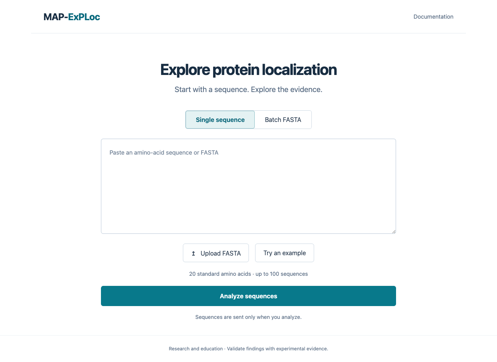
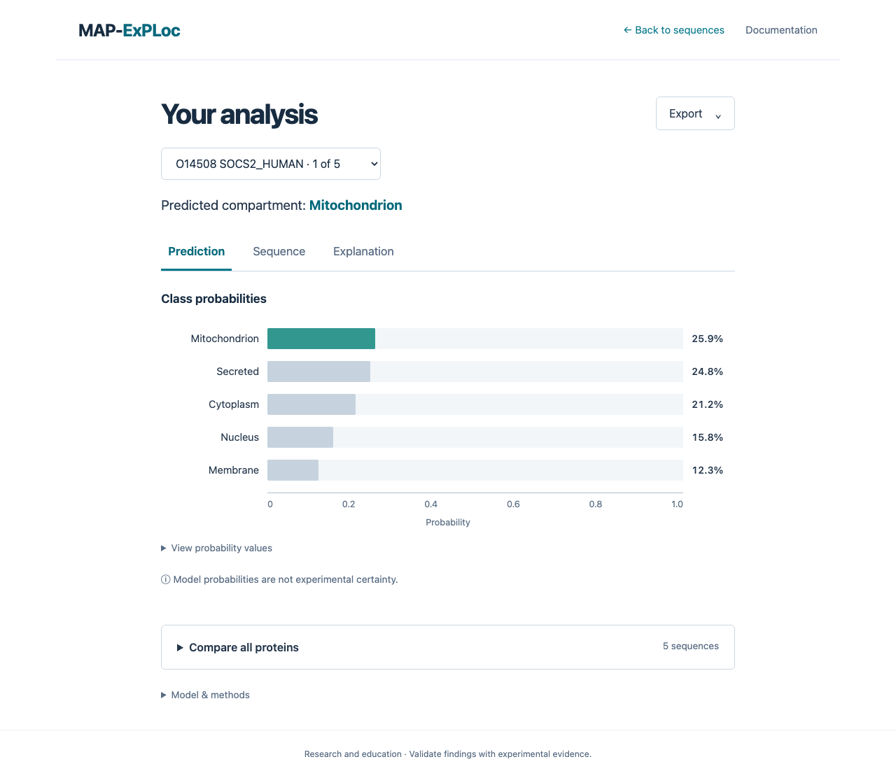

# Interface guide

## Enter sequences

The first screen contains only sequence entry. Paste a raw protein sequence or a single FASTA record, or select Batch FASTA for multiple records. Upload accepts text FASTA files up to 4 MB. Identifiers must be unique and every record must have a sequence. Whitespace and case are normalized; ambiguous residues are rejected with the record identifier in the message.

Limits are 100 sequences, 100,000 residues per sequence and one million residues per request. Nothing is sent while typing or loading examples. Clicking Analyze sequences sends sequences to the configured local/API service. Input and results live only in page memory and disappear on reload; they are not stored in localStorage or sent to external lookup services.

## Explore results

The results screen initially shows class probabilities for one protein. Select another protein without rerunning the batch. Back to sequences preserves the input. Editing and analyzing creates a new result snapshot; canceled and obsolete responses cannot replace it.

- **Prediction:** all model class probabilities, ordered from largest to smallest, with a numeric data table.
- **Sequence:** amino-acid fractions, length, GRAVY and isoelectric point computed by the Python feature extractor.
- **Explanation:** signed predicted-class SHAP contributions, fetched only when opened and cached for that analysis. Negative values oppose the class, positive values support it. The numeric table includes measured feature values. Only top contributions are shown; they need not sum to the full probability.

Prediction results remain available if explanations are unsupported or fail. Retry acts on the selected view. Probabilities are uncalibrated model outputs, not experimental certainty; SHAP does not identify causal residues or motifs.

Batch comparison is collapsed by default. Expand it to sort by protein, length, predicted class or probability; select a row to inspect that protein. Model & methods shows provenance and evaluation when supplied by the configured artifact, and explicitly reports missing metadata for legacy models.

## Export

**Predictions CSV** contains all batch identifiers, names, lengths, predictions and per-class probabilities. Spreadsheet-sensitive identifiers are escaped as text. **Analysis JSON** also includes normalized input sequences, timestamps, descriptors, model provenance and explanations already fetched. Unopened explanations are not fabricated or requested during export.

## Accessibility

Tabs support arrow keys, Home and End. Visible focus, skip navigation, status announcements and numeric chart tables support keyboard and screen-reader use. Small screens stack content; tables and composition plots scroll within their own containers. Motion preferences are respected.

## Development and deployment

```bash
cd ui
pnpm install --frozen-lockfile
pnpm dev
pnpm check
```

Use Node 24 and pnpm 11.18.0. The committed lockfile and narrowly allowed esbuild installation script define the frontend environment. Vite proxies `/predict`, `/explain`, `/features`, `/model`, and `/health` to port 8000. `MAPEXPLOC_API_PROXY` can change the development proxy target when port 8000 is occupied. For production, serve the built UI and API under the same origin, or set `VITE_API_BASE_URL` at build time and configure your reverse proxy for that origin. Do not put secrets in Vite environment variables.

See [troubleshooting](troubleshooting.md) for API/model and installation errors.

## Screens

The entry screen keeps attention on the input:



Results show one visualization at a time. This screenshot contains real baseline outputs; the predicted class is not a verified annotation:


